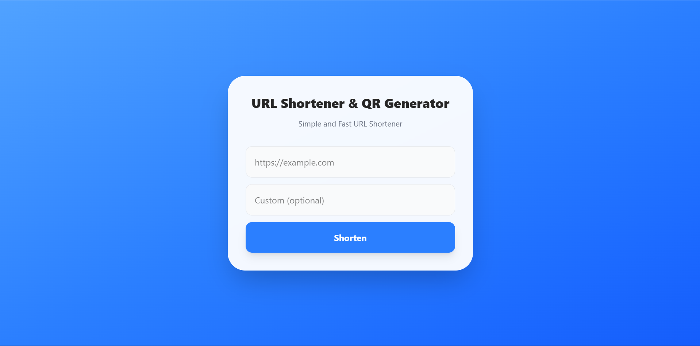
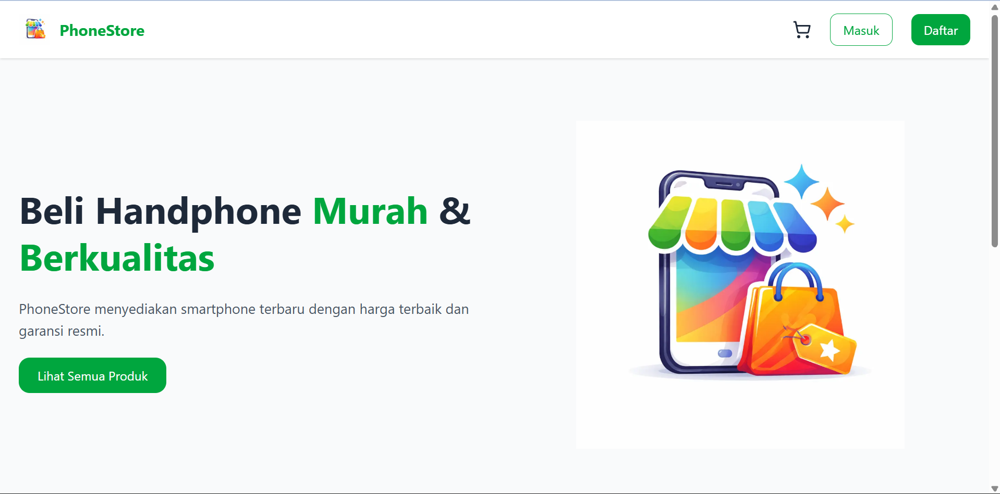

## Hi there! I'm Jeremy Reinhart Parulian 👋

---

### About Me

I am a graduate of Informatics Engineering from Tarumanagara University with hands-on experience from a Fullstack Developer bootcamp, building several individual and team-based web applications as part of intensive project-based learning.

---

## ⭐ Featured Projects

### Circle App — Social Media Platform

  

Fullstack social media application with real-time interaction.

**Tech Stack**  
React.js • Node.js • Express.js • PostgreSQL • Redis • WebSocket • Tailwind CSS

**Key Features**

- JWT authentication & protected routes
- Create, update, and delete posts
- Real-time updates using WebSocket
- Responsive UI

---

### Short Link - URL Shortener

  

A web application to generate and manage shortened URLs.

**Tech Stack**  
Go • React.js • REST API

**Key Features**

- Generate unique short links
- RESTful API for managing links
- Responsive interface for creating short URLs

---

### Split Bill — Smart Receipt Splitter

  

A smart web application that extracts receipt data and automatically calculates bill splitting.

**Tech Stack**  
Next.js 14 • Express.js • Tesseract.js • AI API • Vercel

**Key Features**

- Upload receipt images and extract text using **OCR (Tesseract.js)**
- Convert OCR text into structured bill data using **AI API**
- Automatically calculate and split bills among participants
- Share results instantly via **WhatsApp / Telegram link**

---

### Mini Online Store - PhoneStore

  

Fullstack e-commerce web application with real-time stock updates.

**Tech Stack**  
Next.js • Supabase • Zustand • Tailwind CSS • Midtrans

**Key Features**

- Product catalog and shopping cart
- Real-time stock updates
- Midtrans payment gateway integration

---

### 🛠️ Tech Stack

#### 🎨 Frontend

  
  
  
  
  
  
  
  
  
  

#### ⚙️ Backend

  
  
  
  

#### 🗄️ Database & ORM

  
  
  
  

#### 🧰 Tools

  
  
  
  

---

### 📊 GitHub Stats

  

    
  

  

    
  

---

### 🌐 Let's Connect & create something impactful together

  

    
    
    
  

---

  

  

